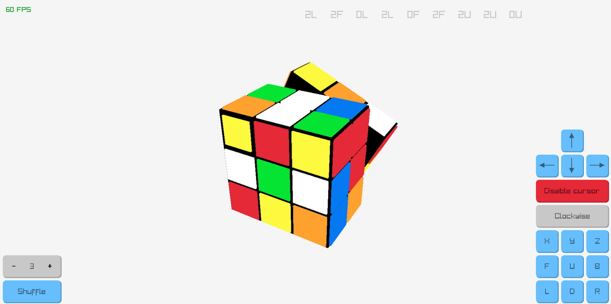
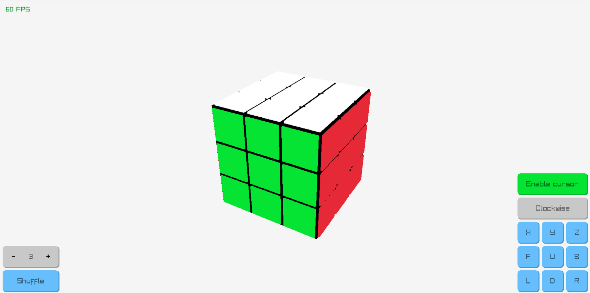
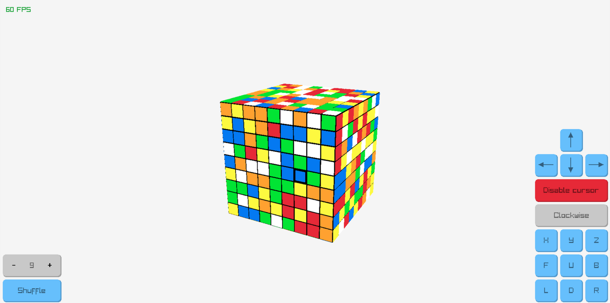

# rubiks cube
A rubiks cube visualiser in C using raylib.


## How to install
Make sure you have `gcc` and `make` installed for your distro.
You can verify the installation by running:
```sh
gcc --version
make --version
```
If you dont have them installed you can use:
#### Arch:
```sh
sudo pacman -S gcc make
```
#### Debian:
```sh
sudo apt install build-essential make
```
#### Other:
Check online.

Next install the `raylib` library. You can follow the guide on the [raylib github](https://github.com/raysan5/raylib/wiki/Working-on-GNU-Linux)

## How to run
Just run the command
```sh
make run
```
This should start the window.

## How to use
Everything can be done using the GUI. You will however need to right click to
rotate the camera. Most GUI elements also have keyboard shortcuts:
```
         F = rotate Front face
         B = rotate Back face
         R = rotate Right face
         L = rotate Left face
         U = rotate Up face
         D = rotate Down face
         X = rotate cube along the X axis
         Y = rotate cube along the Y axis
         Z = rotate cube along the Z axis
     SHIFT = switch rotation direction
         S = Shuffle cube
         C = toggle selection mode
ARROW_KEYS = move cursor around
```
KNOWN ISSUE: the keys are currently using `AZERTY` layout. If you are on a
`QWERTY` keyboard, you need to press `W` instead of `Z`.

## Roadmap
[x] working rubiks cubes
[ ] improve shuffle algorithm + fix crash with 1x1x1
[ ] create a solver

## Screenshots


